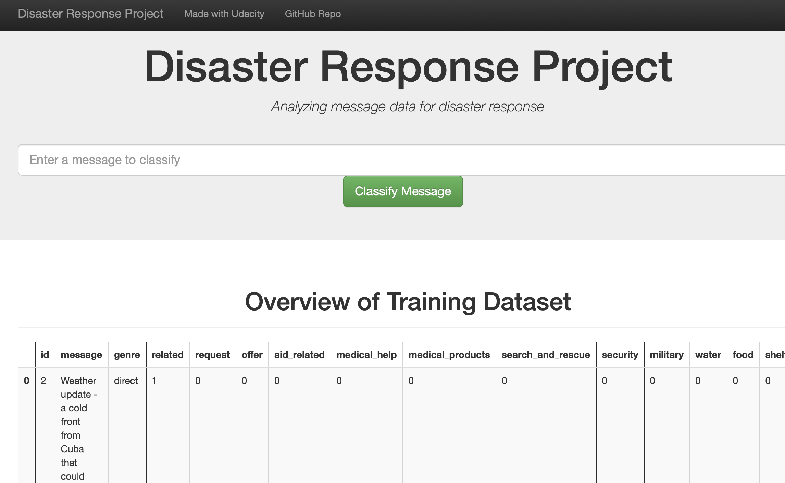
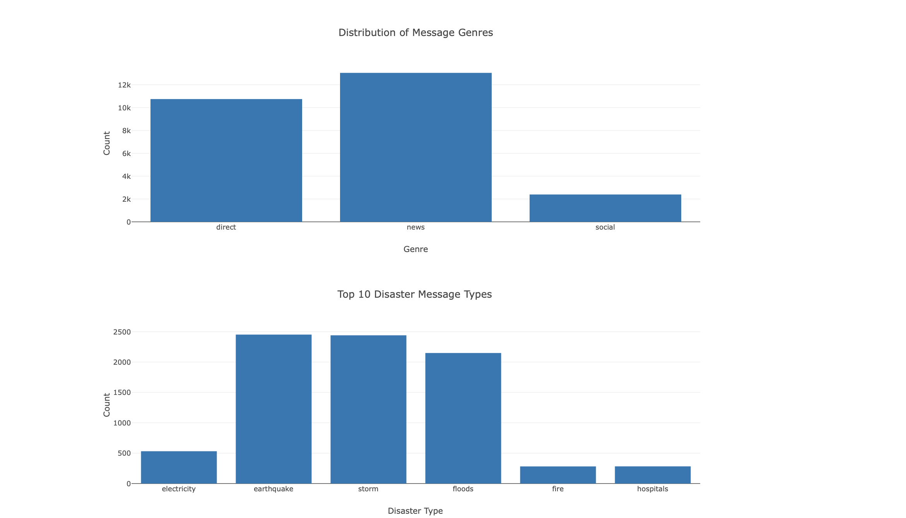

# Disaster Response

###  **Overview:**
This project analyzes thousands of real-world disaster messages to support efficient disaster response. Leveraging datasets of messages and their categories, it builds an ETL pipeline to clean, transform, and store the data in an SQLite database. This structured data is then used in a machine learning pipeline that categorizes each message, helping direct it to the relevant disaster relief agency.

An interactive web application will allow emergency responders to input messages and instantly receive category-based classifications. Additionally, the app includes visualizations that highlight the model’s performance, illustrating classification insights. This project demonstrates advanced skills in constructing end-to-end data pipelines, developing user-friendly applications, and producing clean, production-ready code.

### Prerequisites

1. Git
2. Python 3.7+ (3.11+ preferred)
3. VS Code Editor (or any other IDE)


The following modules are required: 
```
import numpy as np
from tqdm import tqdm
import sqlite3
import pandas as pd
import seaborn as sns
import joblib
import re
import sys
import pickle
import warnings
from nltk.tokenize import word_tokenize
from sklearn.model_selection import cross_val_score
from sklearn.multioutput import MultiOutputClassifier
from sklearn.metrics import accuracy_score, precision_score, recall_score, classification_report
from nltk.stem import WordNetLemmatizer
from sklearn.pipeline import Pipeline
from sklearn.metrics import confusion_matrix
from sklearn.model_selection import train_test_split
from sklearn.ensemble import RandomForestClassifier
from sklearn.feature_extraction.text import CountVectorizer, TfidfTransformer
from sklearn.model_selection import GridSearchCV
from sklearn.linear_model import LogisticRegression
warnings.filterwarnings('ignore')
pd.set_option('display.max_colwidth',True)
```
### Deployment
<ul> ETL Pipeline Preparation.ipynb: Jupyter Notebook containing the ETL code as well as some EDA info. After loading the messages and categories datasets into pandas dataframe, we observe some issues. 
<ul> - The `message` attribute has high percentage of missing values and since it provides a translation of the `original` and it is consistently populated in English,it would be best to drop this column.</ul>
<ul> - Both datasets present duplicated records which can be removed.</ul>
<ul> - the categories dataset has multi-lable econding in single column meaning that the entire set of categories is stored in the column `categories` with each category-label separated by a semicolon. Transformations are required to restructure the dataset into a more analyzable format, where each category is represented as an individual column with binary values indicating presence or absence.</ul>
<ul> - The attribute `child_alone` has only one label (0) which suggests that it does not provide any variability or useful information for analysis. It is advisable to remove this category from the dataset for the following reasons:
<ul> - The attribute `related` has three distinct levels (0, 1, and 2), it’s considered a categorical variable with three levels rather than a binary variable.

ML Pipeline Preparation.ipynb: Jupyter Notebook contining the steps to prepare the ML pipeline.
- process_data.py: Python file for running the ETL pipeline.
- train_classifer.py: Python file for running the ML model.
- run.py: Python file for running the interactive web applicaiton piece. 
- disater_categories.csv: Initial categories dataset.
- disaster_messages.csv: Initial messages dataset.
- template.html: provides the common layout for the website.
- go.html: it is specific to the page and uses the template for structure while injecting unique content.
- DisasterResponse.db: Sqlite3 Database created during the ETL process.
- fire_department.jpg: Readme file intro photo created with AI.
- AppViz1.jpg: Readme file supporting picture.
- AppViz2.jpg: Readme file supporting picture

The model is turned into a pickle file and used in the web application. However, since the file exceeds GitHub's file size limit, it will not be shared to avoid commit issues.
### Resources

- [NLTK](https://www.nltk.org/)
- [Flask](https://flask.palletsprojects.com/en/stable/)
- Html/Css notes
### Outputs
Below are 2 screenshots displaying the web application.



### Acknowledgment
I would like to acknowledge to Stackoverflow, You.com for its generative AI models, and ChatGPT as an instrumental aid in the development of this project.
