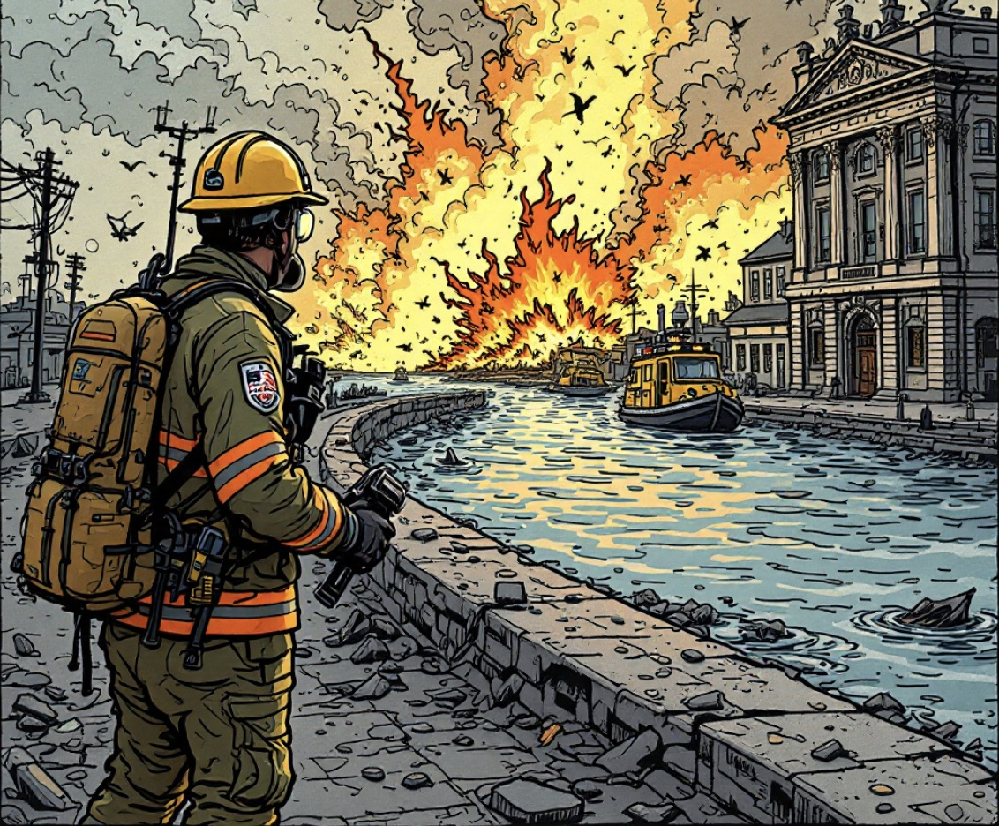

# Disaster Response

###  **Project Overview:**
This project analyzes thousands of real-world disaster messages to support efficient disaster response. Leveraging datasets of messages and their categories, it builds an ETL pipeline to clean, transform, and store the data in an SQLite database. This structured data is then used in a machine learning pipeline that categorizes each message, helping direct it to the relevant disaster relief agency.

An interactive web application will allow emergency responders to input messages and instantly receive category-based classifications. Additionally, the app includes visualizations that highlight the model’s performance, illustrating classification insights. This project demonstrates advanced skills in constructing end-to-end data pipelines, developing user-friendly applications, and producing clean, production-ready code.
### Libraries Used
```import re
import numpy as np
import pandas as pd
import seaborn as nsn
from nltk.tokenize import word_tokenize
from nltk.stem import WordNetLemmatizer
from sklearn.pipeline import Pipeline
from sklearn.metrics import confusion_matrix
from sklearn.model_selection import train_test_split
from sklearn.ensemble import RandomForestClassifier
from sklearn.feature_extraction.text import CountVectorizer, TfidfTransformer
```
